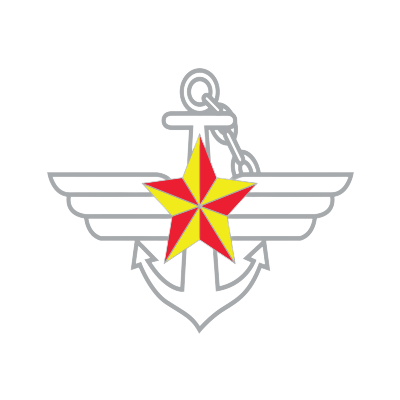

# 半導体入出庫システムの高度化

- <b>顧客会社</b>&nbsp;&nbsp;&nbsp;&nbsp;&nbsp;&nbsp;&nbsp;&nbsp;: 三星(サムスン)電子
- <b>参加期間</b>&nbsp;&nbsp;&nbsp;&nbsp;&nbsp;&nbsp;&nbsp;&nbsp;: 2019.06~2020.01(7ヶ月)
- <b>役割</b>&nbsp;&nbsp;&nbsp;&nbsp;&nbsp;&nbsp;&nbsp;&nbsp;&nbsp;&nbsp;&nbsp;&nbsp;&nbsp;&nbsp;&nbsp;: 開発(チーム)
- <b>O.S</b>&nbsp;&nbsp;&nbsp;&nbsp;&nbsp;&nbsp;&nbsp;&nbsp;&nbsp;&nbsp;&nbsp;&nbsp;&nbsp;&nbsp;&nbsp;&nbsp; : Win、Unix
- <b>言語</b>&nbsp;&nbsp;&nbsp;&nbsp;&nbsp;&nbsp;&nbsp;&nbsp;&nbsp;&nbsp;&nbsp;&nbsp;&nbsp;&nbsp;&nbsp;: Java、Pro*C
- <b>DBMS</b>&nbsp;&nbsp;&nbsp;&nbsp;&nbsp;&nbsp;&nbsp;&nbsp;&nbsp;&nbsp;&nbsp;&nbsp;: Oracle
- <b>Tool</b>&nbsp;&nbsp;&nbsp;&nbsp;&nbsp;&nbsp;&nbsp;&nbsp;&nbsp;&nbsp;&nbsp;&nbsp;&nbsp;&nbsp;&nbsp;: EzDFS
- <b>Framework</b>&nbsp;&nbsp;&nbsp;&nbsp;: EzDFS
- <b>業務内容</b>&nbsp;&nbsp;&nbsp;&nbsp;&nbsp;&nbsp;&nbsp;&nbsp;: 顧客会社で使用している入出庫システムの中で配置計画がPro*Cで組まれているが、これらのプログラムをJava言語で描き直して高度化するプロジェクトである。このプログラムを変換するために使用したToolはEzDFSというToolを使用した。

&nbsp;&nbsp;&nbsp;

# 情報システム

- <b>顧客会社</b>&nbsp;&nbsp;&nbsp;&nbsp;&nbsp;&nbsp;&nbsp;&nbsp;: 国防部
- <b>参加期間</b>&nbsp;&nbsp;&nbsp;&nbsp;&nbsp;&nbsp;&nbsp;&nbsp;: 2020.07~2021.05(10ヶ月)
- <b>役割</b>&nbsp;&nbsp;&nbsp;&nbsp;&nbsp;&nbsp;&nbsp;&nbsp;&nbsp;&nbsp;&nbsp;&nbsp;&nbsp;&nbsp;&nbsp;: 設計、開発(チーム員)
- <b>O.S</b>&nbsp;&nbsp;&nbsp;&nbsp;&nbsp;&nbsp;&nbsp;&nbsp;&nbsp;&nbsp;&nbsp;&nbsp;&nbsp;&nbsp;&nbsp;&nbsp; : Win
- <b>言語</b>&nbsp;&nbsp;&nbsp;&nbsp;&nbsp;&nbsp;&nbsp;&nbsp;&nbsp;&nbsp;&nbsp;&nbsp;&nbsp;&nbsp;&nbsp;: Java,JavaScript,jQuery
- <b>DBMS</b>&nbsp;&nbsp;&nbsp;&nbsp;&nbsp;&nbsp;&nbsp;&nbsp;&nbsp;&nbsp;&nbsp;&nbsp;: Oracle
- <b>Tool</b>&nbsp;&nbsp;&nbsp;&nbsp;&nbsp;&nbsp;&nbsp;&nbsp;&nbsp;&nbsp;&nbsp;&nbsp;&nbsp;&nbsp;&nbsp;: Eclipse, EasyMaker (UI Tool), Oz Report (Report Tool)
- <b>Framework</b>&nbsp;&nbsp;&nbsp;&nbsp;: 電子政府フレームワーク(eGovFrame)
- <b>業務内容</b>&nbsp;&nbsp;&nbsp;&nbsp;&nbsp;&nbsp;&nbsp;&nbsp;: 国防部で軍務員が使用しているウェブプログラムをリニューアルするプロジェクトだ。 担当業務は交信分野を担当し、設計と開発を行った。 設計はテストシナリオ、コンポーネント設計書と要求事項追跡表を主に作成し、開発は主にEclipse、EasyMaker(UITool)、OzReportTool)で作業した。

&nbsp;&nbsp;&nbsp;

